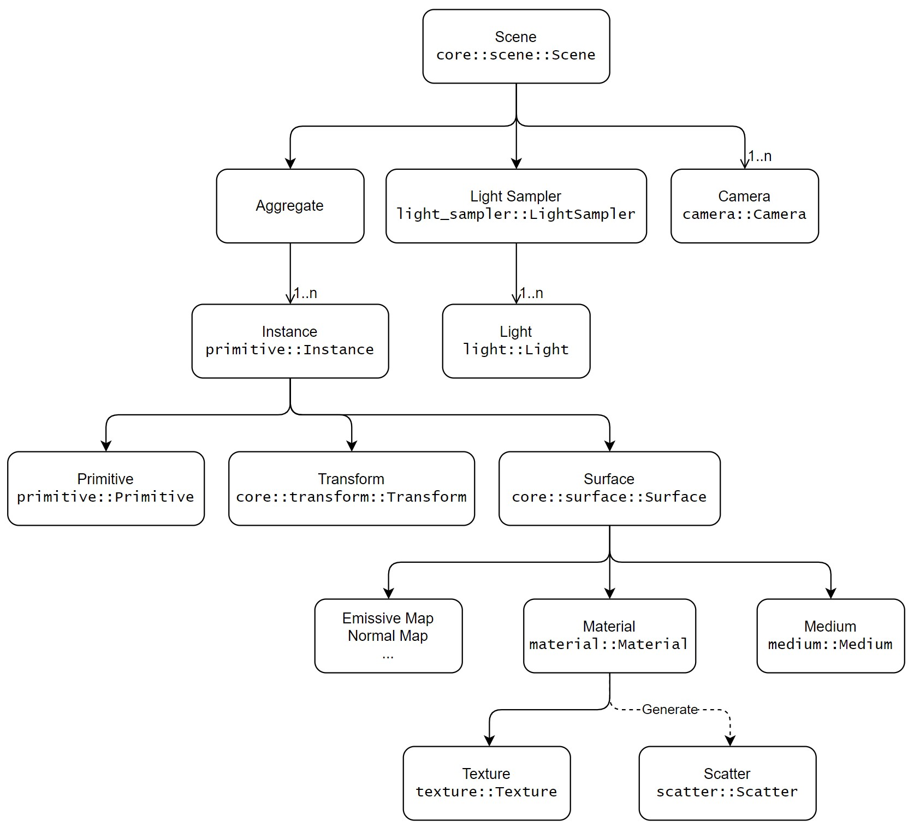

# Simple Path Tracer

A simple path tracer written in Rust.

It's a playground for me to learn something about path tracing.

## Structure

### Aggregate

Collection of `Primitive`s. They are created in top of `Instance`s, and may also be used in some `Primitive`s such as triangle mesh.

* Array
* BVH (SAH)

They are also `Primitive`.

### Primitive

Basic primitive (primitive that doesn't contain other primitives in their structure).

* Sphere
* Triangle
* Cubic Bézier surface

Other primitives

* Triangle mesh
* Catmull-Clark subdivision surface

### Instance

A special `Primitive` consist of a `Primitive`, a transform matrix and a `Surface`. `Instance`s are things that will be rendered.

### Surface

`Surface` describes the material of a surface, the medium inside this surface, and some other things like emissive color and map, normal map.

### Material

* Lambert
* Pseudo material
* Subsurface
* Dielectric
* Glass
* Conductor
* PbrMetallic (Schlick Fresnel is used)
* PbrSpecular (Schlick Fresnel is used)
* P-NDF dielectric/metal ([Position-Normal Distributions for Efficient Rendering of Specular Microstructure, Yan et al. 2016](https://sites.cs.ucsb.edu/~lingqi/publications/paper_glints2.pdf))

### Scatter

`Scatter` describe the BxDF at a certain point of a surface `Material`.

Simple reflect `Scatter`

* Lambert reflect
* Specular reflect
* Microfacet reflect
* Subsurface reflect

Simple transmit `Scatter`

* Lambert transmit
* Specular transmit
* Microfacet transmit

Combiner/Wrapper of `Scatter`s

* Fresnel conductor/dielectric
* Schlick Fresnel metal/dielectric
* Mix

### Medium

* Homogeneous medium

### Texture

Basic `Texture`

* Scalar texture
* Image texture

Combiner/Wrapper of `Texture`s

* sRGB to linear
* Binary operator (addition, subtraction, multiply, division)

### Light Sampler

`LightSampler` is a collection of `Light`s and sample one light with a certain strategy.

* Uniform
* Importance sampling according to estimated light power (using alias table)

### Light

* Directional light
* Point light
* Spot light
* Environment light
* Shape light
  * We never create shape light in scene file explicitly. Shape light will be created from each `Instance` with an emissive `Surface`.

### Camera

* Simple perspective camera

## Implemented Features

* Texture mapping (support tiling and offset) and mipmap
* Importance sampling to HDR(`.exr`) environment map using alias method
* Surface area hierarchy
* Multiple importance sampling
* Simple microfacet material (GGX NDF and Smith separable visible term, importance sampling w.r.t GGX NDF)
* Microfacet glass material
* Homogeneous medium with Henyey-Greenstein phase function
* BSSRDF with normalized diffusion profile
* Glinty surface material ([Position-Normal Distributions for Efficient Rendering of Specular Microstructure, Yan et al. 2016](https://sites.cs.ucsb.edu/~lingqi/publications/paper_glints2.pdf)), last supported commit: [6611661f](https://github.com/PepcyCh/simple-path-tracer/tree/6611661fed3bca4424ca88d8a998dd6c98b68313).
* Cubic Bézier surface
  * Bézier clipping (default)
  * Newton's iteration (feature `bezier_ni`)
* Catmull-Clark subdivision surface
  * Use feature adaptive subdivision
  * Boundary, creases are partially supported
  * Texture mapping are not supported